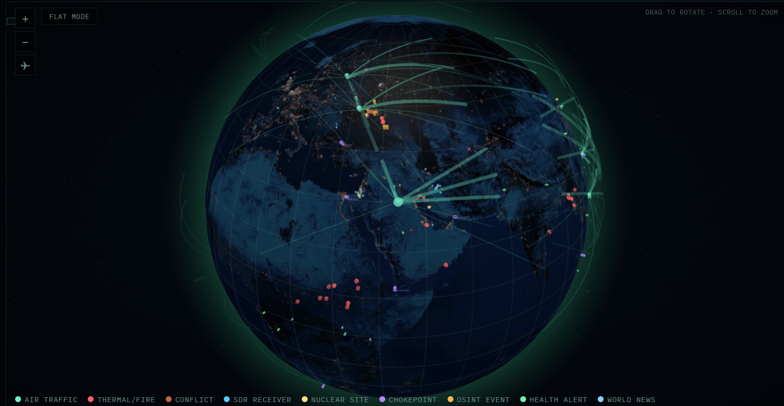

# 🧠 CRUCIX — Open Source Intelligence Terminal


---

## 📖 Оглавление
1. [Описание](#-описание)
2. [Скриншоты](#-скриншоты)
3. [Быстрый старт](#-быстрый-старт)
4. [Что вы получаете](#-что-вы-получаете)
5. [Аналитическая платформа](#-аналитическая-платформа)
6. [Инфраструктурный анализатор](#-инфраструктурный-анализатор)
7. [Router v3.1 — Механизм А+Б](#-router-v31--механизм-аб)
8. [AI-лаборатория](#-ai-лаборатория)
9. [API-ключи](#-api-ключи)
10. [Архитектура](#-архитектура)
11. [Модульная архитектура сервера](#-модульная-архитектура-сервера)
12. [🗺️ Геополитическая карта (geo-map)](#️-геополитическая-карта-geo-map)
13. [🧭 Система полярности и сверки нарративов](#-система-полярности-и-сверки-нарративов)
14. [Источники данных](#-источники-данных)
15. [npm-скрипты](#-npm-скрипты)
16. [Конфигурация](#-конфигурация)
17. [API-эндпоинты](#-api-эндпоинты)
18. [Устранение неполадок](#-устранение-неполадок)
19. [Расширения](#-расширения)
20. [AI-чат](#-ai-чат)
21. [Вклад в проект](#-вклад-в-проект)
22. [🧠 Прогностическое ядро Crucix](#-прогностическое-ядро-crucix)
23. [📰 SmartScroll — интеграция RSS и Telegram](#-smartscroll--интеграция-rss-и-telegram)
24. [Лицензия](#-лицензия)

## 🚀 Описание

**Crucix** — платформа для сбора, анализа и визуализации данных из открытых источников. Предназначена для мониторинга геополитической, экономической, военной и экологической обстановки в реальном времени.

Архитектура построена по принципу **«Корзина → AI → Карта»**:

- **Сбор** — данные приходят из 226 источников в корзину (`data/basket/`)
- **Анализ** — 59 анализаторов считают индексы, композиты, прогнозы (`data/analytics/`)
- **AI** — локальный LLM (Ollama) генерирует брифы и прогнозы
- **Карта** — результат визуализируется на геокарте (3D WebGL Globe + 2D D3 Map + Leaflet)

### Ключевые возможности

- ✅ **226 OSINT-источников** — спутники, авиация, конфликты, экономика, экология
- ✅ **59 анализаторов** — индексы, детекторы, прогнозы, композиты
- ✅ **370+ API-модулей** — все эндпоинты данные из корзины
- ✅ **8 категорий аналитики** — index, detector, forecast, semantic, flow, market, specialist, space
- ✅ **3D WebGL-глобус** + 2D-карта с 9 типами маркеров
- ✅ **Leaflet-карта** с 237 слоями, тепловой картой и хронологией
- ✅ **Инфраструктурный анализатор** — 114 объектов, 15 эндпоинтов
- ✅ **Автообновление** каждые 15 минут через SSE
- ✅ **Telegram + Discord боты** с двухсторонним управлением
- ✅ **AI-аналитика** через Ollama (локально, без облака)
- ✅ **Модульная архитектура** — легко расширять
- ✅ **Zero cloud, zero telemetry, zero subscriptions**

> **Live website:** [https://www.crucix.live/](https://www.crucix.live/)

---

## 📸 Скриншоты

| | |
|-|-|
|||
|**Главный дашборд**|**Анимация загрузки**|

| |
|-|
||
|**2D-карта с маркерами**|

| |
|-|
||
|**3D WebGL-глобус**|

---

## ⚡ Быстрый старт

### Локальный запуск

```bash
# 1. Клонировать репозиторий
git clone https://github.com/calesthio/Crucix.git
cd Crucix

# 2. Установить зависимости (только Express)
npm install

# 3. Скопировать шаблон .env и добавить API-ключи
cp .env.example .env

# 4. Запустить дашборд
npm run dev
```

Дашборд откроется на `http://localhost:3117`

Если `npm run dev` не работает, запустите напрямую:

```bash
node --trace-warnings server.mjs
```

### Docker

```bash
git clone https://github.com/calesthio/Crucix.git
cd Crucix
cp .env.example .env
docker compose up -d
```

---

## 🎯 Что вы получаете

### Дашборд

- **3D WebGL-глобус** (Globe.gl) с атмосферой и звёздным полем
- **2D-карта** (D3) с 9 типами маркеров
- **Leaflet-карта** с 237 слоями, тепловой картой и хронологией
- **Анимированные дуги** полётов между авиаузлами
- **Фильтры по регионам** (Мир, Америка, Европа, Ближний Восток, Азия, Африка)
- **Рыночные данные** в реальном времени (индексы, крипто, энергия, металлы)

### Аналитика

- **59 анализаторов** — от базовых индексов до композитных рисков
- **197 стран** в справочнике характеристик
- **147 стран** с реальным коэффициентом Джини
- **194 страны** с макроэкономикой World Bank
- **114 объектов** критической инфраструктуры (25 военных баз, 20 АЭС, 26 портов, 15 чокпоинтов, 15 дамб, 13 энергосетей)
- **8 категорий** аналитики в `data/analytics/`

### AI-возможности

- **Локальный LLM** через Ollama
- **AI-брифы** (daily, alert, summary)
- **Прогнозы** через AI
- **Семантический поиск** по новостям (TF-IDF + cosine similarity)
- **Извлечение сущностей** (NER) из текстов

### Интеграции

- **Telegram-бот** (двухсторонний)
- **Discord-бот** (двухсторонний)
- **MCP Server** (Model Context Protocol) — доступ к Crucix из внешних AI-клиентов
- **CLI-аналитика** — запросы к анализаторам из терминала

---

## 📊 Аналитическая платформа

В Crucix встроена **полноценная аналитическая платформа** — 59 анализаторов партии №2, разделённые на **8 категорий**.

### Категории анализаторов

| Категория | Описание | Кол-во |
|---|---|---|
| **index** | Индексы (страновые, региональные) | 2 |
| **detector** | Детекторы событий и аномалий | 8 |
| **forecast** | Прогностические модели | 4 |
| **semantic** | Семантический анализ текстов | 6 |
| **flow** | Потоки (торговля, миграция, ресурсы) | 10 |
| **market** | Рыночные индикаторы | 7 |
| **specialist** | Специализированные (инфра, ядер, санкции) | 21 |
| **space** | Космос | 1 |
| **ИТОГО** | | **59** |

### Ключевые анализаторы

**Индексы (index):**
- `country-instability` — Индекс нестабильности страны (CII). Эталон внедрения.
- `resilience-index` — Индекс устойчивости (197 стран, 152 уникальных балла)

**Композиты (specialist):**
- `strategic-risk-composite` — Стратегический риск (инстабильность + дефицит устойчивости + инфраструктура + геополитика)
- `infrastructure-cascade` — Каскадный анализ инфраструктуры (13 файлов, 15 эндпоинтов)

**Прогнозы (forecast):**
- `conflict-escalation-tracker` — Эскалация конфликтов (6 уровней)
- `ai-forecasts` — Прогнозы через LLM
- `social-briefing` — Брифы через LLM (daily, alert, summary)
- `central-bank-predictor` — Прогноз действий центробанков

**Детекторы (detector):**
- `geo-convergence` — Конвергенция по географии
- `threat-classification` — Классификация угроз
- `surge-detection` — Всплески аномалий
- `focal-point-detection` — Фокусные точки активности
- `baseline-alerting` — Пороговые уведомления
- `cyber-attack-monitor` — Кибератаки
- `snapshot-system` — Снимки состояния
- `pizza-index` — Активность у штаб-квартир (внутренний индекс)

**Семантика (semantic):**
- `adaptive-news-clustering` — Кластеризация новостей (TF-IDF)
- `ai-news-synthesis` — AI-синтез новостей
- `entity-extraction` — NER
- `multi-source-corroboration` — Проверка фактов
- `source-credibility` — Достоверность источников
- `social-sentiment-analyzer` — Тональность соцсетей

**Потоки (flow):**
- `cross-stream-correlation` — Кросс-корреляция потоков данных
- `route-explorer` — Альтернативные маршруты
- `supply-chain-cascade-engine` — Каскады цепочек поставок
- `supply-chain-resilience` — Устойчивость поставок
- `tanker-fleet-monitor` — Танкерный флот (тёмные суда)
- `arms-transfer-tracker` — Передача вооружений
- `diplomatic-tracker` — Дипломатическая активность
- `migration-flow-tracker` — Миграционные потоки
- `signal-aggregator` — Агрегация сигналов
- `risk-signal-aggregator` — Агрегация рисков

**Рынки (market):**
- `market-composite` — Рыночный композит (VIX, нефть, золото, DXY)
- `derived-market-analytics` — Производные метрики (Gold/Oil, Copper/Gold)
- `energy-market-intelligence` — Энергетические рынки
- `prediction-markets` — Прогнозные рынки
- `stablecoin-monitor` — Стейблкоины
- `etf-flow-analysis` — Потоки ETF
- `fx-reserves-monitor` — Валютные резервы
- `tick-data-analyzer` — Тиковые данные

**Специалисты (specialist) — продолжение:**
- `sanctions-pressure` — Санкционное давление
- `political-stability-monitor` — Политическая стабильность
- `food-security-monitor` — Продовольственная безопасность

**Космос (space):**
- `satellite-analyzer` — Анализ спутников

### Как работает анализ

1. **Сбор** — сборщики (`scripts/collectors/`) кладут данные в корзину `data/basket/`
2. **Расчёт** — анализаторы (`scripts/analyzers/`) читают корзину + справочники, считают индексы, пишут в `data/analytics/{category}/`
3. **Отдача** — API-модули (`apis/sources/{name}-api.mjs`) читают результаты, отдают через `/api/layers/{name}`
4. **Отображение** — слой на карте (`dashboard/public/geo-map/js/layers.js`) показывает результат

### Структура `data/analytics/`

```
data/analytics/
├── _manifest.json     # реестр всех анализаторов
├── _catalog.json      # каталог классов
├── _lineage.json      # происхождение данных
├── _health.json       # статус
├── _schema.json       # схема
├── index/             # индексы
├── detector/          # детекторы
├── forecast/          # прогнозы
├── semantic/          # семантика
├── flow/              # потоки
├── market/            # рынки
├── specialist/        # специалисты
└── space/             # космос
```

### Запуск анализатора

```bash
# Один анализатор
node scripts/analyzers/resilience-index.mjs

# Все анализаторы (вручную)
for f in scripts/analyzers/*.mjs; do node "$f"; done

# Полный цикл: сбор → анализ → отдача
node scripts/collectors/collect-worldbank.mjs
node scripts/analyzers/strategic-risk-composite.mjs
curl http://localhost:3117/api/layers/strategic-risk-composite/stats
```

---

## 🏗️ Инфраструктурный анализатор

**Infrastructure Cascade** — самый сложный анализатор в Crucix. Состоит из **13 файлов** и отдаёт **15 эндпоинтов**.

### Файлы

**Блок A (ядро):**
- `infrastructure-graph-core.mjs` — граф, haversine
- `infrastructure-propagation.mjs` — каскадное распространение
- `infrastructure-pagerank-critical.mjs` — PageRank, междуness
- `infrastructure-temporal.mjs` — temporal decay

**Блок B (расчёт):**
- `infrastructure-vulnerability-calc.mjs` — адаптивный расчёт уязвимости
- `infrastructure-monte-carlo.mjs` — Monte Carlo, sensitivity
- `infrastructure-scenario-engine.mjs` — 8 сценариев (Ормуз, Тайвань, АЭС...)

**Блок C (мониторинг):**
- `infrastructure-military-monitor.mjs` — военные базы
- `infrastructure-chokepoint-monitor.mjs` — проливы, каналы
- `infrastructure-nuclear-monitor.mjs` — АЭС
- `infrastructure-supply-chain.mjs` — HHI концентрация
- `infrastructure-cargo-anomaly.mjs` — аномалии грузопотоков

**+ `infrastructure-api.mjs`** — HTTP-обработчик

### Объекты инфраструктуры

`data/infrastructure/objects.json` — **114 объектов:**

- 25 военных баз (США, Россия, Китай, НАТО)
- 20 АЭС (Запорожская, Фукусима, Бушер, Аккую...)
- 26 портов (Шанхай, Сингапур, Роттердам...)
- 15 чокпоинтов (Ормуз, Суэц, Тайвань, Баб-эль-Мандеб...)
- 15 дамб (Три ущелья, Итайпу, Каховская...)
- 13 энергосетей (Восточный Китай, ERCOT, Укрэнерго...)

### 15 эндпоинтов

```
GET /api/layers/infrastructure-api                    — корень
GET /api/layers/infrastructure-api/vulnerability      — уязвимость
GET /api/layers/infrastructure-api/cascade            — каскад
GET /api/layers/infrastructure-api/simulate           — симуляция
GET /api/layers/infrastructure-api/critical-paths     — критические пути
GET /api/layers/infrastructure-api/pagerank           — PageRank
GET /api/layers/infrastructure-api/sensitivity        — чувствительность
GET /api/layers/infrastructure-api/featurecollection  — GeoJSON
GET /api/layers/infrastructure-api/stats              — статистика
GET /api/layers/infrastructure-api/military           — военные объекты
GET /api/layers/infrastructure-api/chokepoints        — проливы
GET /api/layers/infrastructure-api/nuclear            — АЭС
GET /api/layers/infrastructure-api/supply-chain       — цепочки поставок
GET /api/layers/infrastructure-api/cargo-anomalies    — аномалии
GET /api/layers/infrastructure-api/scenarios          — сценарии
```

### Ключевые результаты

- **PageRank → chokepoint-taiwan** (самый связанный узел)
- **Top bottleneck → chokepoint-malacca**
- **Vulnerability max → npp-zaporizhzhia**
- **Sensitivity → exposure** (наиболее влияющий фактор)
- **Сценарий Тайвань-блокада → 3 узла затронуто**
- **Сценарий Ормуз-закрытие → 5 узлов затронуто**

---

## 🔀 Router v3.1 — Механизм А+Б

**Router** (`server/router.mjs`) — ключевой компонент. Определяет, какой модуль обработает запрос.

### 4 механизма поиска

**1. Механизм А (приоритет) — `export const route`:**

API-модуль сам декларирует префикс:
```javascript
export const route = '/api/layers/infrastructure-api';
export default handleInfrastructureAPI;
```

Router при загрузке модуля читает `module.route` и регистрирует в `modulePrefixCache`. Все последующие запросы к `/api/layers/infrastructure-api/*` идут **микросекундно** из кэша.

**2. routes-api.json — точное совпадение:**

Запись `{ path: '/api/layers/country-instability', module: 'country-instability-api' }`. Работает для legacy-модулей.

**3. routes-api.json — wildcard:**

Запись `{ path: '/api/layers/infrastructure-api/*', module: 'infrastructure-api' }`. Работает как fallback.

**4. Механизм Б — авто-префикс:**

Если файл в `apis/sources/` называется `{name}-api.mjs` — автоматически доступен через `/api/layers/{name}/*`. Для 300+ legacy-модулей.

### Приоритет поиска

1. `modulePrefixCache` (Механизм А) — самый быстрый
2. `routes-api.json (exact)` — точное совпадение
3. `routes-api.json (wildcard)` — с учётом `*`
4. `autoPrefixCache` (Механизм Б) — по имени файла

### Для разработчика

**Новый API-модуль** — рекомендуется добавить `export const route` (Механизм А):

```javascript
// apis/sources/my-module-api.mjs
export const route = '/api/layers/my-module';

export default async function handler(req, res) {
  // ...
}
```

**Больше не нужно** добавлять запись в `routes-api.json` вручную. Модуль сам регистрируется.

---

## 🧪 AI-лаборатория

Лаборатория ИИ — среда, где локальный LLM (Ollama) становится активным участником анализа.

### Компоненты

- **Ollama** — `http://localhost:11434`, модели: llama3.1:8b, mistral:7b, phi3:3.8b
- **AI Gateway** — `apis/sources/ai-gateway.mjs`
- **RAG-модуль** — `apis/sources/rag-module/`, порт 3120
- **AI Chat** — `http://localhost:8080`

### Pipeline AI-лаборатории

1. **Сбор данных** → `data/basket/*.json`
2. **Расчёт анализаторов** → `data/analytics/{category}/*.json`
3. **Отдача через API** → `GET /api/layers/{name}`
4. **AI-прогнозирование** → `data/analytics/forecast/*.json`
5. **Генерация брифа** → `daily-briefing.mjs` через Ollama
6. **Семантический поиск** → RAG-модуль на порту 3120

### AI-модули

- **ai-news-synthesis** — синтез новостей через LLM
- **ai-forecasts** — вероятностный прогноз
- **social-briefing** — 3 формата брифов (daily, alert, summary)
- **daily-briefing.mjs** — ежедневный дайджест

---

## 🔑 API-ключи

Crucix **работает без API-ключей** — используются только открытые источники. Правило проекта (12.2): запрет на регистрации, ключи, OAuth.

### Открытые источники (без ключей)

- **USGS Earthquakes** — землетрясения
- **NOAA SWPC** — космическая погода
- **OpenSky Network** — самолёты (анонимно)
- **Open-Meteo** — погода
- **Where the ISS at** — МКС
- **Launch Library 2** — космические запуски
- **Frankfurter** — курсы валют ЕЦБ
- **Hacker News** — топ-новости
- **mledoze/countries** — справочник 250 стран
- **CISA KEV** — уязвимости
- **CoinGecko** — крипта
- **US Treasury** — долг США
- **ECB Data Portal** — макро ЕС
- **World Bank** — макро 197 стран
- **GDELT** — новости (требует browser User-Agent, пауза ≥5 сек)

### Если всё-таки нужен ключ

Один ключ (может пригодиться): `OLLAMA_HOST` для внешнего Ollama. Это локально — регистрация не нужна.

---

## 🏛️ Архитектура

### Принцип «Корзина → AI → Карта»

```
Внешний API
    ↓
Сборщик (scripts/collectors/collect-*.mjs)
    ↓
Корзина (data/basket/*.json)
    ↓
Анализатор (scripts/analyzers/*.mjs)
    ↓
Аналитика (data/analytics/{category}/*.json)
    ↓
API-модуль (apis/sources/*-api.mjs)
    ↓
Карта (dashboard/public/geo-map/)
```

### Ключевое правило

**Ни один модуль не делает fetch к внешним API.** Все данные только из корзины. Единственное исключение — сборщики, которые наполняют корзину.

### Структура проекта

```
Crucix/
├── apis/sources/            # 370+ API-модулей
├── scripts/
│   ├── collectors/          # сборщики в корзину
│   └── analyzers/           # анализаторы
├── data/
│   ├── basket/              # 226 файлов данных
│   ├── analytics/           # 8 категорий аналитики
│   ├── infrastructure/      # 114 объектов
│   ├── reference/           # справочники (197 стран, Джини)
│   └── geo/                 # world.geojson, country-coords
├── server/                  # серверные модули
│   ├── router.mjs           # роутер v3.1
│   ├── loader.mjs           # загрузчик модулей
│   ├── modules.json         # 370+ модулей
│   ├── routes-api.json      # legacy-маршруты
│   └── server.mjs           # точка входа
├── dashboard/public/        # страницы и геокарта
├── docs/help/               # справки ru/en
├── ai-memory-sync/          # файлы памяти AI
└── logs/collectors/         # логи сборщиков
```

---

## 🧩 Модульная архитектура сервера

Все серверные файлы в `server/`:

- `server.mjs` — точка входа (30 строк)
- `router.mjs` — API-роутер (Механизм А+Б)
- `loader.mjs` — загрузчик модулей из `modules.json`
- `api.mjs` — API-маршруты (реестр и др.)
- `pages.mjs` — маршруты страниц
- `utils.mjs` — утилиты (`sendJSON`, `sendError`)
- `config.mjs` — порт, MIME-типы
- `static.mjs` — раздача статики
- `modules.json` — реестр API-модулей (370+)
- `routes-api.json` — API-маршруты (legacy)
- `pages.json` — реестр страниц
- `routes-pages.json` — маршруты страниц

---

## 🗺️ Геополитическая карта (geo-map)

Главный файл: `dashboard/public/geo-map.html`.

Скрипты в `dashboard/public/geo-map/js/`:

- `core.js` — ядро карты
- `countries.js` — данные стран
- `layers.js` — **237 слоёв**, 16 категорий
- `markers.js` — маркеры
- `map-controls.js` — управление картой (markers / choropleth / heatmap)
- `copy-data.js` — кнопка КОПИРОВАТЬ
- `heat-timeline.js` — тепловая карта и хронология
- `ssi.js` — индекс напряжённости
- `refresh.js` — автообновление
- `logger.js` — логирование
- `init.js` — инициализация

### Как добавить слой

1. Создать API-модуль в `apis/sources/{id}-api.mjs` с `export const route`
2. Создать анализатор в `scripts/analyzers/{id}.mjs` (если нужно)
3. Добавить слой в `layers.js` (массив `DEMO_LAYERS`)
4. Перезапустить сервер

Подробнее — в `docs/help/ru/layers/`.

---

## 🧭 Система полярности и сверки нарративов

**Версия:** 1.0 · **Добавлено:** 22–23.09.2026

### Что это

Система, которая **вычисляет геополитическую полярность из данных** и **сверяет российский и западный нарративы по заданной теме**. Не пропаганда — сравнительный анализ фреймингов (comparative framing analysis) на наблюдаемых данных.

**Ключевой принцип:** полюс **вычисляется**, а не задаётся списком. Если данные изменятся — полюс изменится автоматически.

### Компоненты

| Файл | Тип | Назначение |
|------|-----|------------|
| `apis/sources/pole-tracker-api.mjs` | API | Вычисляет полярность стран из 8 basket-индикаторов |
| `apis/sources/narrative-splitter-api.mjs` | API | Сверяет российский и западный нарративы по теме |
| `apis/sources/source-camps.json` | Конфиг | Маппинг источников и baseline стран по полюсам |
| `dashboard/public/pole-map.html` | Страница | Карта полюсов: страны, confidence, векторы |
| `dashboard/public/narrative-arena.html` | Страница | Сверка нарративов: Россия / Запад / Расхождения |
| `scripts/snapshot-rsshub.mjs` | Скрипт | Накопление истории новостей (systemd timer) |

### Страницы

- **🌐 Карта полюсов** — [http://localhost:3117/pole-map](http://localhost:3117/pole-map)
  Показывает три полюса (russian / western / non_aligned) со странами, индекс полярности, векторы (санкции, инфовойна, военное присутствие), basket-статус.

- **⚡ Сверить нарративы** — [http://localhost:3117/narrative-arena](http://localhost:3117/narrative-arena)
  Три колонки: российский нарратив / западный нарратив / расхождения. Пресеты: санкции, Украина, энергопереход, конфликт, газ.

### API-эндпоинты

```bash
# Все полюса
curl http://localhost:3117/api/layers/pole-tracker

# Одна страна детально
curl "http://localhost:3117/api/layers/pole-tracker?country=russia"

# Сверка нарративов по теме
curl -G http://localhost:3117/api/layers/narrative-splitter \
    --data-urlencode "topic=Украина" \
    --data-urlencode "limit=10"

# Детальный вывод
curl "http://localhost:3117/api/layers/narrative-splitter?topic=санкции&detail=true"
```

### Что означают термины

| Термин | Смысл |
|--------|-------|
| **silence** | Одна сторона пишет (N>0), другая молчит (0). Сильнейший сигнал замалчивания |
| **framing_gap** | Обе стороны пишут, но с разным фреймингом |
| **double_standard** | Дисбаланс освещения >3x в одну сторону |
| **polarity_index** | 0..1: 0 = однополярный мир, 1 = максимальная полярность |
| **confidence** | 0..0.98: уверенность в классификации страны |
| **basis** | Источник классификации: `baseline_plus_data` / `data_driven` / `weak_signals` / `no_data` |

### Накопление истории

Скрипт `scripts/snapshot-rsshub.mjs` запускается по **systemd timer каждый час в 02 минуты**:

- Обновляет `data/basket/rsshub.json` через `collect-rsshub.mjs`
- Копирует снимок в `data/analytics/rss-history/rsshub-<timestamp>.json`
- Ведёт индекс `index.json`
- Обрезает архив до 168 снимков (7 дней)

```bash
# Управление таймером
systemctl --user status crucix-rsshub-snapshot.timer
systemctl --user list-timers crucix-rsshub-snapshot.timer
tail -20 logs/rss-history/systemd.log

# Ручной запуск
node scripts/snapshot-rsshub.mjs
```

**Зачем:** через неделю накопится 84 000 items — достаточно для реального анализа co-occurrence тем (threat inflation, selective framing).

### Справки

Полные справки по каждой странице и модулю:
- `data/help/ru/pole-tracker-api.txt` — API модуля полярности
- `data/help/ru/narrative-splitter-api.txt` — API модуля сверки
- `data/help/ru/pole-map.txt` — страница карты полюсов
- `data/help/ru/narrative-arena.txt` — страница сверки нарративов
- `data/help/ru/CRUCIX_POLARITY_OVERVIEW.txt` — общий обзор системы

### Как расширять

**Добавить источник в полюс:**
Редактируй `apis/sources/source-camps.json` → `media_sources.{pole}.sources`. Маппинг — по подстроке в lowercase.

**Добавить индикатор:**
Редактируй `apis/sources/source-camps.json` → `indicators.basket_files`. Затем добавь чтение в `computeCountryVector()` в `pole-tracker-api.mjs`.

**Добавить страну в baseline:**
Редактируй `apis/sources/source-camps.json` → `pole_cores.{pole}.core` (или `baseline_satellites`, `affiliated`).

### Принципы

1. **Полюс вычисляется, а не задаётся.** Данные изменятся — полюс изменится.
2. **Сравнение симметрично.** Система показывает расхождения и у российской, и у западной стороны.
3. **Метод прозрачный.** Любой может открыть basket-файл и увидеть, на каких записях основана классификация.
4. **Это инструмент, а не приговор.** Система не говорит «кто прав» — она показывает, где стороны расходятся.

---

## 📡 Источники данных

226 файлов в `data/basket/`. Ключевые:

### Геополитика и конфликты
- `acled.json` — вооружённые конфликты
- `gdelt.json` — новости и события
- `ucdp-latest.json` — данные UCDP
- `conflict-zone.json` — зоны конфликтов

### Военное
- `military-bases.json` — военные базы
- `military-exercises.json` — учения
- `military-spending.json` — расходы
- `nuclear-monitor.json` — ядерный мониторинг

### Экономика и рынки
- `worldbank-latest.json` — 194 страны World Bank
- `coingecko-latest.json` — крипта
- `fred.json` — макро (ECB + Treasury + WB)
- `fx-rates.json` — курсы валют (Frankfurter)
- `vix.json`, `gold.json`, `oil.json`, `dxy.json` — рыночные индикаторы
- `treasury-debt.json` — долг США

### Природные явления
- `earthquakes.json` — землетрясения (USGS)
- `firms.json` — пожары (NASA FIRMS)
- `noaa.json` — космическая погода
- `open-meteo.json` — погода (10 городов)
- `wildfires.json` — лесные пожары

### Космос
- `satellites.json` — спутники
- `iss-live.json` — МКС онлайн
- `launches-upcoming.json` — предстоящие запуски
- `space-debris.json` — космический мусор

### Инфраструктура
- `data/infrastructure/objects.json` — **114 объектов**

### Справочники
- `data/reference/country-characteristics.json` — **197 стран**
- `data/reference/gini-index.json` — **147 стран с Джини**
- `data/reference/country-aliases.json` — 152 алиаса
- `data/reference/rest-countries.json` — 250 стран (mledoze)

### Технологии и кибербезопасность
- `cisa-kev.json` — известные уязвимости
- `cve.json` — CVE
- `botnets.json` — ботнеты
- `ransomware.json` — ransomware

### Прочее
- `hackernews-top.json` — HN
- `cables_24.json` — подводные кабели
- `pipelines_24.json` — трубопроводы
- `datacenters.json` — датацентры

---

## 📜 npm-скрипты

```bash
npm run dev              # запуск сервера (порт 3117)
npm run collect          # запуск всех сборщиков
npm run analyze          # запуск всех анализаторов
npm run daily-briefing   # генерация ежедневного брифа
npm run registry         # генерация реестра
```

---

## ⚙️ Конфигурация

### Переменные окружения

Скопируйте `.env.example` в `.env`. Основные переменные:

- `PORT` — порт сервера (по умолчанию 3117)
- `OLLAMA_HOST` — URL Ollama (по умолчанию `http://localhost:11434`)
- `TELEGRAM_BOT_TOKEN` — токен бота (опционально)
- `DISCORD_WEBHOOK_URL` — webhook Discord (опционально)

### Важно

**Crucix работает без API-ключей.** Все источники — открытые. Если ключ нужен — его нет в проекте, используйте альтернативы.

---

## 🔌 API-эндпоинты

### Основные

- `GET /api/registry/` — реестр модулей
- `GET /api/geo/markers` — маркеры карты
- `GET /api/geo/status` — статус
- `GET /api/layers` — список слоёв

### Аналитические (новые)

**Индексы:**
- `GET /api/layers/country-instability/stats`
- `GET /api/layers/resilience-index/stats`

**Композиты:**
- `GET /api/layers/strategic-risk-composite/stats`
- `GET /api/layers/strategic-risk-composite/top?n=10`
- `GET /api/layers/strategic-risk-composite/bottom?n=10`

**Инфраструктура:**
- `GET /api/layers/infrastructure-api/stats`
- `GET /api/layers/infrastructure-api/military`
- `GET /api/layers/infrastructure-api/nuclear`
- `GET /api/layers/infrastructure-api/chokepoints`
- `GET /api/layers/infrastructure-api/scenarios`
- ...и ещё 10 эндпоинтов

**Рынки:**
- `GET /api/layers/market-composite/score`
- `GET /api/layers/derived-market-analytics/stats`
- `GET /api/layers/energy-market-intelligence/stats`

**Прогнозы:**
- `GET /api/layers/conflict-escalation-tracker/stats`
- `GET /api/layers/social-briefing/text`
- `GET /api/layers/ai-forecasts/stats`

**Детекторы:**
- `GET /api/layers/geo-convergence/stats`
- `GET /api/layers/threat-classification/stats`
- `GET /api/layers/surge-detection/stats`
- `GET /api/layers/focal-point-detection/stats`

**Семантика:**
- `GET /api/layers/adaptive-news-clustering/stats`
- `GET /api/layers/ai-news-synthesis/stats`
- `GET /api/layers/entity-extraction/stats`
- `GET /api/layers/source-credibility/stats`

**Потоки:**
- `GET /api/layers/cross-stream-correlation/stats`
- `GET /api/layers/route-explorer/stats`
- `GET /api/layers/tanker-fleet-monitor/stats`
- `GET /api/layers/arms-transfer-tracker/stats`

**Специалисты:**
- `GET /api/layers/sanctions-pressure/stats`
- `GET /api/layers/political-stability-monitor/stats`
- `GET /api/layers/food-security-monitor/stats`

**Системные:**
- `GET /api/layers/mcp-server/stats`
- `GET /api/layers/crucix-doctor/stats`
- `GET /api/layers/module-registration-controller/stats`
- `GET /api/layers/watchdog/stats`

---

## 🔧 Устранение неполадок

### Сервер не запускается

- Проверить `node --version` — нужен Node 22+
- Проверить `npm install`
- Проверить лог `/tmp/crucix-server.log`

### Анализатор не работает

- `node scripts/analyzers/{name}.mjs` — проверить вывод
- `curl http://localhost:3117/api/layers/{name}/stats` — проверить эндпоинт
- Проверить `data/analytics/{category}/{name}.json` — создан ли файл

### Сборщик возвращает 0 данных

- Проверить доступность источника: `curl {url}`
- Проверить лог `logs/collectors/collect-{name}.log`
- Убедиться, что нет API-ключа (правило 12.2)

### GDELT возвращает 429

- Требуется User-Agent браузера
- Требуется пауза ≥5 секунд между запросами
- Таймаут ≥30 секунд

---

## 🧩 Расширения

### Как создать новый анализатор

1. **Класс-вычислитель** — `apis/sources/{name}.mjs`
   - `export default class {Name}` 
   - Метод `compute(input)` возвращает `{ score, components, ... }`

2. **Анализатор** — `scripts/analyzers/{name}.mjs`
   - Импортирует класс
   - Читает `data/basket/` и `data/reference/`
   - Пишет `data/analytics/{category}/{name}.json`
   - В `_meta`: id, category, version, sources, calculator, updated_at, checksum

3. **API-модуль** — `apis/sources/{name}-api.mjs`
   - `export const route = '/api/layers/{name}'`
   - `export default async function handler(req, res)`
   - Читает `data/analytics/{category}/{name}.json`

4. **Регистрация** — `server/modules.json`:
   ```json
   { "id": "{name}-api", "path": "./apis/sources/{name}-api" }
   ```

5. **Слой на карте** — `layers.js` (массив `DEMO_LAYERS`):
   ```javascript
   { id: '{name}', name: 'Название', color: '#цвет', icon: '🎯', category: 'категория', vizType: 'marker' }
   ```

6. **Перезапуск сервера.**

### Как создать новый сборщик

1. Файл `scripts/collectors/collect-{name}.mjs`
2. Импорт из открытого API (без ключа)
3. Сохранение в `data/basket/{name}.json`
4. Лог в `logs/collectors/collect-{name}.log`
5. Регистрация в cron

---

## 💬 AI-чат

AI-чат работает через локальный Ollama.

### Установка Ollama

```bash
# 1. Установить Ollama
curl -fsSL https://ollama.com/install.sh | sh

# 2. Скачать модель
ollama pull llama3.1:8b

# 3. Запустить Ollama
ollama serve &

# 4. Открыть AI-чат
open http://localhost:3117/ai-chat
```

### Промпты

AI-чат использует данные анализаторов как контекст. Модель отвечает на вопросы о:
- Текущей геополитической обстановке
- Рисках стран
- Рыночных индикаторах
- Инфраструктурных угрозах
- Прогнозах

---

## 🤝 Вклад в проект

Приветствуются:

1. **Новые анализаторы** — по эталону (класс → анализатор → API → слой)
2. **Новые сборщики** — только открытые API (без ключей)
3. **Новые справочники** в `data/reference/`
4. **Улучшение существующих модулей**
5. **Справки на двух языках** (ru + en)

### Правила

- Соблюдать архитектуру «Корзина → AI → Карта»
- Не использовать API-ключи (правило 12.2)
- Писать справки на ru + en
- Не удалять существующие модули (правило 7.6)

---


## 🧠 Прогностическое ядро Crucix

С 18.09.2026 в проект интегрировано **прогностическое ядро** — 16-фазный конвейер (A–R, S, T, U, Z) из 22 модулей, работающих на 30 научных дисциплинах.

### Ключевое

- **Движок** `apis/predict/engine.mjs` v8.0.0 — 16-фазный конвейер.
- **22 модуля** прогностического ядра: байесовское ядро, наивный байес, цепи Маркова, Монте-Карло, временные ряды, Brier-калибровка, каскадные цепочки, ансамбль, LLM-агенты, процесс Хоукса, HMM, фильтр Калмана, Изинг, перенос энтропии, SIR/SEIR, EVT, Орнштейн-Уленбек, копулы, BOCPD, Particle Filter, MLP, GCN+DQN.
- **Источники**: `apis/predict/sources/` — prediction_markets (Polymarket/Metaculus/Kalshi/Manifold), multilang (100+ языков), satellite (Sentinel-2/Landsat/SAR).
- **Граф знаний**: `apis/knowledge/graph.mjs`.
- **Новые страницы**: /cockpit, /agent, /hypergraph, /plugins, /realtime, /advanced, /attention, /coevolution, /crucix, /predictions_composite.
- **Плагины**: `plugins/` — loader, sandbox, hooks, registry, manifest_schema.
- **Интеграции**: `integrations/` — Slack, Notion, Obsidian, RSS, Email, Webhook.
- **Наблюдаемость**: `observability/` — OpenTelemetry, Prometheus, Grafana.
- **Тесты**: `tests/` — 42 файла (unit, property, fuzz, mutation, integration, chaos, load). Smoke-тест: 22/22 OK.
- **Развёртывание**: `docker/` — Dockerfile.engine + docker-compose.engine.yml. `k8s/` — 11 манифестов.
- **Документация**: `docs/handbook/` — книга 800+ страниц, `docs/help/ru` и `docs/help/en` — справки.

### Запуск тестов

```bash
npm run test:all-modules       # smoke-тест 22 модулей
npm run test:unit              # unit-тесты
npm run test:integration       # интеграционные
npm run test:property          # property-based
npm run test:fuzz              # fuzz-тесты
npm run test:mutation          # мутационные
```

---

## 📰 SmartScroll — интеграция RSS и Telegram

С 24.09.2026 в проект интегрирован **SmartScroll 1.0.0** — комплект сбора, дедупликации, кластеризации и суммаризации новостных потоков из RSS и Telegram. Результат работы — сюжеты, таймлайны и сводки, встроенные в граф знаний Crucix.

### Ключевое

- **Комплект**: `apis/sources/smartscroll*` — 16 модулей, 3 режима работы (external / local / auto).
- **Коллекторы**: RSS 2.0 + Atom и публичные Telegram-каналы через `t.me/s/` — без API-ключей и токенов.
- **Дедупликация**: 4 уровня — хеш контента, сигнатура сущностей, шинглы Jaccard, косинус TF-IDF.
- **Кластеризация**: inverted index по сущностям — поиск кандидатов за O(1) вместо O(N).
- **Суммаризация**: extractive (TF-IDF + MMR) + abstractive через локальный Ollama с автоматическим fallback.
- **HTTP-сервер**: 8 эндпоинтов на порту `3157` (переменная `SMARTSCROLL_HTTP_PORT`).
- **Метрики**: время по каждой стадии цикла (collect, normalize, dedup, cluster, summarize, store).
- **Отказоустойчивость**: rate limiter (token bucket) и circuit breaker во внешнем адаптере.
- **Валидация дат**: отсев событий старше 10 лет и будущих более чем на 24 часа.

### Состав комплекта

```
apis/sources/smartscroll-interface.mjs         — общий интерфейс (контракт v3)
apis/sources/smartscroll.mjs                    — внешний адаптер с rate limiter и circuit breaker
apis/sources/smartscroll-local/index.mjs        — фабрика источника (external / local / auto)
apis/sources/smartscroll-local/engine.mjs       — ядро цикла с per-stage метриками
apis/sources/smartscroll-local/processing/     — нормализация, дедупликация, кластеризация, сводка, таймлайн
apis/sources/smartscroll-local/storage/        — файловое JSON-хранилище сюжетов
apis/entity-model/story-layer.mjs               — модель сущностей: маппинг сюжетов в граф знаний
apis/ingest/event-ingestion-api.mjs             — HTTP-сервер SmartScroll
scripts/collectors/lib/rss-collector.mjs        — RSS 2.0 + Atom с валидацией дат
scripts/collectors/lib/telegram-collector.mjs   — чтение публичных Telegram-каналов
scripts/collectors/collect-smartscroll.mjs      — сборщик комплекта (пишет в корзину)
config/smartscroll.json                         — конфигурация комплекта
test/smartscroll/                               — 6 тестовых файлов (юнит + интеграция)
```

### HTTP-эндпоинты

```
GET  /health                     — состояние источника и графа
GET  /metrics                    — метрики производительности по стадиям
GET  /stats                      — сводка по сюжетам и событиям
GET  /stories?limit=N&since=ISO  — список сюжетов
GET  /stories/:id                — детали сюжета
GET  /stories/:id/timeline       — таймлайн сюжета
POST /run                        — ингестия сюжетов в граф
POST /collect                    — полный цикл сбора из источников
```

### Запуск

```bash
# Запустить сборщик
cd /home/ta8_/Рабочий\ стол/Crucix && node scripts/collectors/collect-smartscroll.mjs

# Запустить HTTP-сервер SmartScroll
cd /home/ta8_/Рабочий\ стол/Crucix && SMARTSCROLL_HTTP_PORT=3157 node apis/ingest/event-ingestion-api.mjs

# Запустить тесты
cd /home/ta8_/Рабочий\ стол/Crucix && node test/smartscroll/run-all.mjs
```

### Метрики

- Режимов работы: 3 (external / local / auto)
- Коллекторов: 2 (RSS, Telegram)
- Уровней дедупликации: 4
- Весов кластеризации: 3 (сущности 0.5, заголовок 0.3, тело 0.2)
- Методов суммаризации: 2 (extractive + abstractive)
- Типов узлов модели сущностей: 3 (Story, TimelineEvent, Entity)
- Типов рёбер: 4 (contains, mentions, related_to, evolves_into)
- HTTP-эндпоинтов: 8
- Тестов: 51 (30 юнит + 21 интеграция)

### Документация

Подробная документация по каждому модулю:

- **Русский**: [`docs/help/ru/modules/smartscroll/`](docs/help/ru/modules/smartscroll/INDEX.md) — 17 файлов, оглавление + 16 справок по модулям.
- **English**: [`docs/help/en/modules/smartscroll/`](docs/help/en/modules/smartscroll/INDEX.md) — 17 files, table of contents + 16 module reference files.
- **Манифест комплекта**: [`MANIFEST-smartscroll.md`](MANIFEST-smartscroll.md).

Каждый файл справки содержит: назначение, расположение, методы, алгоритмы, связи с другими модулями, примеры.

## 📜 Лицензия

AGPLv3. См. `LICENSE`.

---

**Crucix** — ваш личный аналитический центр. 226 источников. 59 анализаторов. Одна команда. Без облака.
